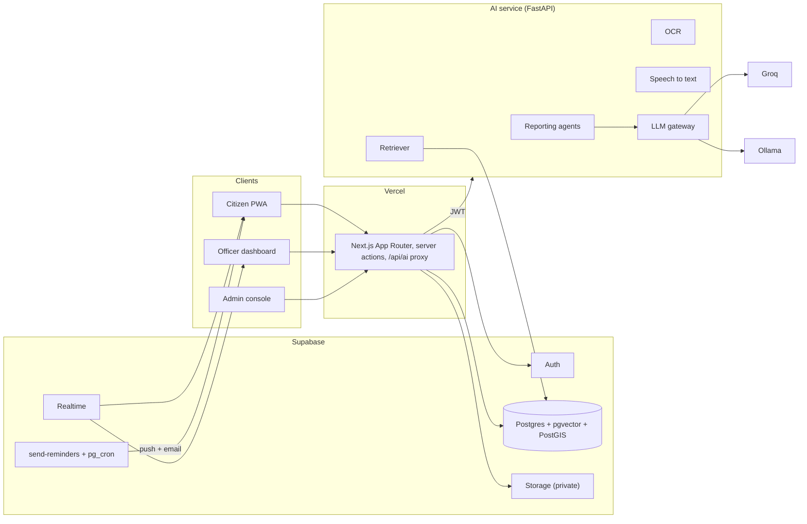

# Architecture

## Request path

The browser never talks to the AI service directly. It calls `/api/ai/*` on the web app
(`apps/web/app/api/ai/[...path]/route.ts`), which attaches the caller's identity and forwards
the request:

- **With Supabase:** the user's access token as `Authorization: Bearer …`. The AI service
  verifies it (HS256 secret or the project's JWKS) and reads `app_metadata.role` and
  `app_metadata.ward`, which a database trigger keeps in sync with `profiles`.
- **Demo mode (no Supabase):** `X-Demo-Role` / `X-Demo-User`, set from the role switcher
  cookie. There is no real login in demo mode. Never deploy it with real data.

Writes that involve an agent (create report, approve plan, update status) are Next.js server
actions (`apps/web/app/actions.ts`) that call the AI service. Saving deadlines and notices
goes straight to Supabase under row-level security.

## The LLM gateway

`apps/ai-service/app/llm/gateway.py` tries providers in `LLM_PROVIDERS` order (default
`groq,ollama`). Rate limits, timeouts and invalid JSON all count as a failure, and the gateway
moves on to the next provider. If every provider fails it raises `LLMUnavailable`, and each
pipeline falls back to deterministic rules:

| Pipeline | With a model | Rules fallback |
|---|---|---|
| Notice fields | Strict JSON extraction, cross-checked against regexes | Regex extraction (amounts, Hindi/English dates, authorities) |
| Explanation | Simpler rewrite of the template, facts pinned | Bilingual templates per notice type |
| Service Q&A | Grounded answer with `[n]` citations, streamed | Most relevant guide section verbatim, with its link |
| Scheme explanation | One-line explanation | The rule engine's own reasons |
| Report category | Used when keyword confidence is low | Hindi/English/Hinglish keyword lexicon |
| Action plan | Model-drafted steps | Category templates |

The demo therefore keeps working with no model at all. `/health` reports which providers are
up, and the header shows it as a status dot.

Text is PII-masked (`privacy/pii_mask.py`) before any model call. The one exception is the
optional vision-OCR fallback, which sends the photo itself. It is off unless
`ALLOW_VISION_FALLBACK=true`.

## Reporting pipeline

`apps/ai-service/app/agents/graph.py` runs intake → investigator → clustering → planner, then
stops at `awaiting_approval`. That stop is the human-in-the-loop interrupt: nothing is
dispatched until an officer calls `POST /v1/clusters/{id}/decision`. The coordinator agent
then assigns the department, sets the SLA due time and fans the status out to every report in
the cluster. The verifier compares before and after photos. Feedback either verifies the fix
or reopens the whole issue for a fresh officer decision. Every transition is appended to
`report_events`, which a trigger makes append-only.

The nodes are plain async functions over a `TriageState` dataclass. The blueprint names
LangGraph. Each node maps one-to-one onto a LangGraph node, and the approval stop maps onto
`interrupt_before=["coordinator"]`. The dependency was left out because the MVP has no need
for checkpointed resumption: the approval state already lives in the database.

**Clustering** scores open clusters of the same category within `CLUSTER_RADIUS_M` (150 m) as
`0.6 × text similarity + 0.4 × proximity`, and merges when the score is ≥ 0.55. Reports under
50 m apart always merge, because people describe one pothole in very different words. In
Postgres the radius search is `nearby_open_clusters()` (PostGIS `ST_DWithin` on a generated
geography column).

## Scheme eligibility

`apps/ai-service/app/pipelines/schemes.py` evaluates the rules in `data/schemes/*.json`. When
an income band straddles a scheme's limit, the result is `needs_check` ("an income certificate
will decide") rather than a guess. The model only phrases explanations for schemes that
already passed.

## Storage layout

Private buckets `janseva-notices`, `janseva-reports` and `janseva-sources`, prefixed so they
cannot collide with another app's buckets on a shared Supabase project (see below). Object
paths start with the owner's user id (`<uid>/<file>`), and storage policies check the first
folder. The AI service reads objects with the service key only after checking that the path
belongs to the caller.

## Stores

`store/memory.py` (demo, seeded with a few Lucknow issues) and `store/supabase.py` (PostgREST
with the service key) implement the same interface. Because the service key bypasses RLS, the
AI service enforces roles itself: `require_role`, ward checks, and ownership checks on
verify and feedback.

## Sharing a Supabase project with other apps

JANSEVA's Supabase project can be shared with unrelated apps (each project has a free-tier
cap of two). Everything JANSEVA owns is isolated so the two can never collide:

| Shared resource | How JANSEVA stays isolated |
|---|---|
| Database schema | Every table, function and trigger lives in a dedicated `janseva` Postgres schema (`create schema janseva`), never `public`. `supabase/migrations/…_expose_schema.sql` exposes it to PostgREST *additively* — it reads the project's existing `pgrst.db_schemas` setting and only adds `janseva`, never removes `public` or another app's schema. The web app's Supabase clients (`lib/supabase/client.ts`, `lib/supabase/server.ts`) and the AI service's REST calls (`store/supabase.py`) all set `janseva` as their schema/profile so every query is scoped automatically. |
| Postgres extensions | `vector` and `postgis` install into the `extensions` schema (this project's own convention — check what's already there with `select extname, nspname from pg_extension join pg_namespace on pg_namespace.oid = extnamespace` before assuming), never `public`. |
| Storage buckets | Bucket ids are one global list per project (no schema concept). JANSEVA's are prefixed `janseva-notices` / `janseva-reports` / `janseva-sources`. |
| `auth.users` (Supabase Auth) | Necessarily shared — there is one user pool per project. A user who signs up through either app becomes an authenticated user for both. JANSEVA's `on_auth_user_created` trigger only ever inserts into `janseva.profiles`, and its JWT claim is nested at `app_metadata.janseva.{role,ward}` (never a top-level `role`/`ward` key), so it can't overwrite or read a claim another app sets. |

Before reusing a Supabase project for a second app, it's worth checking what's already there
(`list_tables`, and a query against `pg_proc`/`pg_trigger` for name collisions) — the schema
and bucket-prefix approach above avoids collisions by construction, but a security review of
what any *other* app's own RLS policies allow is outside JANSEVA's control.
