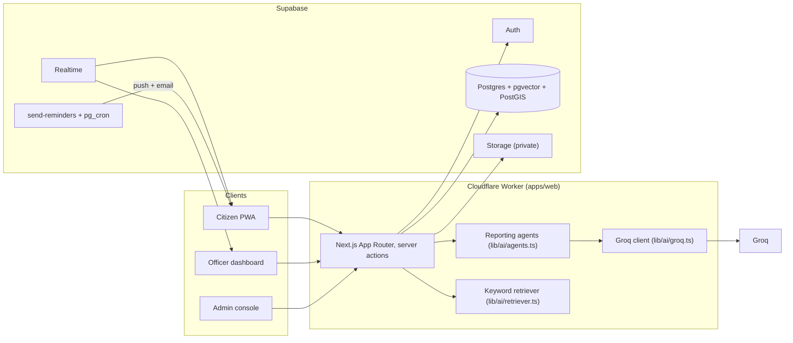

# Architecture

```mermaid
flowchart LR
  subgraph Clients
    C1["Citizen PWA"]
    C2["Officer dashboard"]
    C3["Admin console"]
  end
  subgraph CF["Cloudflare Worker (apps/web)"]
    W["Next.js App Router, server actions"]
    AG["Reporting agents (lib/ai/agents.ts)"]
    RAG["Keyword retriever (lib/ai/retriever.ts)"]
    G["Groq client (lib/ai/groq.ts)"]
  end
  subgraph Supabase
    A["Auth"]
    DB[("Postgres + pgvector + PostGIS")]
    S["Storage (private)"]
    RT["Realtime"]
    EF["send-reminders + pg_cron"]
  end
  C1 & C2 & C3 --> W
  W --> A & DB & S
  W --> AG & RAG
  AG --> G
  G --> Groq
  RT --> C1 & C2
  EF -->|"push + email"| C1
```

> **This used to be two deployments** (a Next.js app on Vercel calling a separate FastAPI AI
> service over JWT-authenticated HTTP) and is now one: the AI logic was ported into
> `apps/web/lib/ai/` as native Next.js API routes, and the whole app deploys as a single
> Cloudflare Worker (`apps/web/wrangler.jsonc`, built with `@opennextjs/cloudflare`). See
> "Why this changed" below for what that cost.

## Request path

`/api/ai/v1/*` routes in `apps/web/app/api/ai/` run the logic directly — there is no separate
service or network hop to authenticate across. Each route reads the caller's identity straight
from the existing session helper (`lib/session.ts`, cookie-based via Supabase SSR), which
already resolves `app_metadata.janseva.role` from the verified JWT. Demo mode (no Supabase)
still works via the same role-switcher cookie read by that helper.

Writes that involve an agent (create report, approve plan, update status) are Next.js server
actions (`apps/web/app/actions.ts`) that call these routes over a same-origin HTTP request
(kept as HTTP, not a direct function call, so the request/response contract — and this file's
description of it — stays identical to before the port). Saving deadlines and notices goes
straight to Supabase under row-level security, as before.

## Why this changed, and what it cost

Cloudflare Workers can't run a Python/FastAPI process, native OCR binaries (tesseract), or
PIL-based image diffing — the three things the original `apps/ai-service` depended on besides
plain HTTP calls. Porting to TypeScript-on-Workers meant:

- **OCR → vision model.** A photographed notice is now sent directly to Groq's vision model
  (`meta-llama/llama-4-scout-17b-16e-instruct`) to transcribe, instead of running tesseract
  locally first. This is strictly a privacy trade-off (the image itself leaves the app, not
  just OCR'd text) — the original service treated this exact path as opt-in
  (`ALLOW_VISION_FALLBACK`); here it's the only path available for photographed notices.
- **Hash-based retrieval embedding → dropped.** The original service blended keyword overlap
  (0.6 weight) with a dependency-free hash embedding (0.4 weight) for both document retrieval
  and report-cluster text similarity. That embedding was never a real model (see
  `EMBED_PROVIDER=hash`), so dropping it in favor of pure keyword scoring/pure geo-proximity
  clustering is a quality simplification, not the loss of a real semantic signal.
- **Before/after photo verifier → dropped.** Comparing a resolved report's before/after photos
  (perceptual hash + histogram diff, via PIL) needed native image decoding. This was already
  advisory only, by its own docstring ("not proof of a fix"); the citizen's own confirmation
  (`/v1/reports/{id}/feedback`) remains the real mechanism, unchanged.
- **Evals harness → fixtures only.** `evals/run_evals.py` imported the Python service's modules
  directly; with that service gone, the golden `.jsonl` sets in `evals/` have no runner. They
  weren't deleted, but need a new TS harness to run again.

Everything else — PII masking, rule-based field extraction, scheme eligibility rules, the
Supabase REST calls, and the reporting pipeline's node sequence — ported with no behavioral
change; see each module's header comment in `apps/web/lib/ai/` for specifics.

## The LLM gateway

`apps/web/lib/ai/groq.ts` calls Groq directly (no local-model fallback — Workers can't reach a
local Ollama instance the way the old service could). Rate limits, timeouts and invalid JSON
all count as a failure (`LLMUnavailable`), and each pipeline falls back to deterministic rules:

| Pipeline | With a model | Rules fallback |
|---|---|---|
| Notice fields | Strict JSON extraction, cross-checked against regexes | Regex extraction (amounts, Hindi/English dates, authorities) |
| Explanation | Simpler rewrite of the template, facts pinned | Bilingual templates per notice type |
| Service Q&A | Grounded answer with `[n]` citations, streamed | Most relevant guide section verbatim, with its link |
| Scheme explanation | One-line explanation | The rule engine's own reasons |
| Report category | Used when keyword confidence is low | Hindi/English/Hinglish keyword lexicon |
| Action plan | Model-drafted steps | Category templates |

The demo therefore keeps working with no model at all. `/health` reports which providers are
up, and the header shows it as a status dot.

Text is PII-masked (`lib/ai/pii.ts`) before any model call. The one exception is the vision
fallback for photographed notices (see "Why this changed" above), which sends the photo
itself — now the only path available for a photo, not opt-in.

## Reporting pipeline

`apps/web/lib/ai/agents.ts` runs intake → investigator → clustering → planner, then stops at
`awaiting_approval`. That stop is the human-in-the-loop interrupt: nothing is dispatched until
an officer calls `POST /v1/clusters/{id}/decision`. The coordinator then assigns the
department, sets the SLA due time and fans the status out to every report in the cluster.
Feedback either verifies the fix or reopens the whole issue for a fresh officer decision. Every
transition is appended to `report_events`, which a trigger makes append-only. (The before/after
photo verifier that used to sit between "resolved" and feedback was dropped — see "Why this
changed" above; the feedback step itself is unchanged.)

The pipeline is plain async functions called in sequence within one request — it always was,
even in the original FastAPI service (the blueprint names LangGraph, but nothing here needed
checkpointed resumption: the approval state already lives in the database, not in a suspended
process), so this ported with no structural change.

**Clustering** scores open clusters of the same category within `CLUSTER_RADIUS_M` (150 m) by
proximity alone (`0.4 × proximity`, merging when the score is ≥ 0.55; reports under 50 m apart
always merge). The original also blended in a 0.6-weighted text similarity from the
dependency-free hash embedding dropped in this port (see "Why this changed" above) — proximity
alone is the one real behavior simplification here, not just a renamed file. In Postgres the
radius search is still `nearby_open_clusters()` (PostGIS `ST_DWithin` on a generated geography
column), unchanged.

## Scheme eligibility

`apps/web/lib/ai/schemes.ts` evaluates the rules in `data/schemes/*.json` (bundled into
`apps/web/lib/ai/data/schemes/`). When
an income band straddles a scheme's limit, the result is `needs_check` ("an income certificate
will decide") rather than a guess. The model only phrases explanations for schemes that
already passed.

## Storage layout

Private buckets `janseva-notices`, `janseva-reports` and `janseva-sources`, prefixed so they
cannot collide with another app's buckets on a shared Supabase project (see below). Object
paths start with the owner's user id (`<uid>/<file>`), and storage policies check the first
folder. `lib/ai/auth.ts`'s `downloadObject` reads objects with the service key only after
checking that the path belongs to the caller.

## Store

`lib/ai/store.ts` talks to `janseva.*` tables over PostgREST with the service key, same
approach as the original `store/supabase.py` (the in-memory demo store, `store/memory.py`,
wasn't ported — the Next.js app always has at least the demo-mode role switcher regardless).
Because the service key bypasses RLS, the route handlers enforce roles themselves:
`requireRole`, ownership checks on triage/feedback (`lib/ai/auth.ts`).

## Sharing a Supabase project with other apps

JANSEVA's Supabase project can be shared with unrelated apps (each project has a free-tier
cap of two). Everything JANSEVA owns is isolated so the two can never collide:

| Shared resource | How JANSEVA stays isolated |
|---|---|
| Database schema | Every table, function and trigger lives in a dedicated `janseva` Postgres schema (`create schema janseva`), never `public`. `supabase/migrations/…_expose_schema.sql` exposes it to PostgREST *additively* — it reads the project's existing `pgrst.db_schemas` setting and only adds `janseva`, never removes `public` or another app's schema. The web app's Supabase clients (`lib/supabase/client.ts`, `lib/supabase/server.ts`) and the AI routes' service-role REST calls (`lib/ai/store.ts`) all set `janseva` as their schema/profile so every query is scoped automatically. |
| Postgres extensions | `vector` and `postgis` install into the `extensions` schema (this project's own convention — check what's already there with `select extname, nspname from pg_extension join pg_namespace on pg_namespace.oid = extnamespace` before assuming), never `public`. |
| Storage buckets | Bucket ids are one global list per project (no schema concept). JANSEVA's are prefixed `janseva-notices` / `janseva-reports` / `janseva-sources`. |
| `auth.users` (Supabase Auth) | Necessarily shared — there is one user pool per project. A user who signs up through either app becomes an authenticated user for both. JANSEVA's `on_auth_user_created` trigger only ever inserts into `janseva.profiles`, and its JWT claim is nested at `app_metadata.janseva.{role,ward}` (never a top-level `role`/`ward` key), so it can't overwrite or read a claim another app sets. |

Before reusing a Supabase project for a second app, it's worth checking what's already there
(`list_tables`, and a query against `pg_proc`/`pg_trigger` for name collisions) — the schema
and bucket-prefix approach above avoids collisions by construction, but a security review of
what any *other* app's own RLS policies allow is outside JANSEVA's control.
